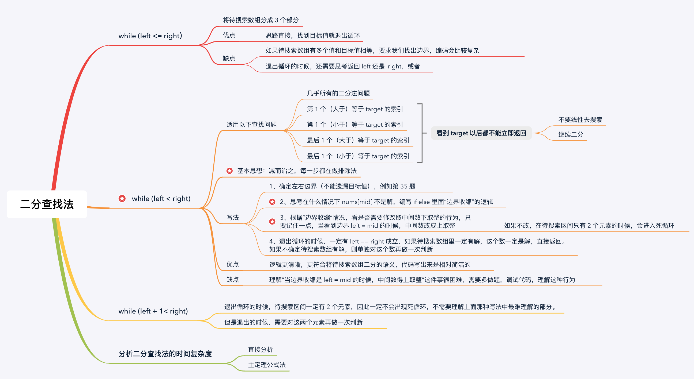

学习笔记

## 二分查找

通过在有序数组里每次都排除当前规模的一半， 从而实现以logn的复杂度来寻找目标值

**二分查找的前提**

1. 目标函数单调性（有时也可以用于不完全有序的）
2. 存在上下界
3. 能通过索引访问

[参考原文](https://leetcode-cn.com/problems/search-insert-position/solution/te-bie-hao-yong-de-er-fen-cha-fa-fa-mo-ban-python-/)

#### 减治思想解决二分查找难题

关键点：把待搜索的目标值留在最后判断，在循环体内不断地把不符合题目要求的子区间排除掉，在退出循环以后，因为只剩下 1 个数没有看到，它要么是目标元素，要么不是目标元素，单独判断即可。

具体做法：

1. 循环的条件是left<right， 退出循环时一定left==right成立。 此时要注意：left （right） 这个位置的值可能程序还没有读取到，因此“有可能”需要再对 left（right） 这个位置的值是否是目标元素的值做一次判断。
2. 写if-else分支时， **考虑好nums[mid] 满足什么条件时mid不是解**， 进而减小规模（减治）。
3. 考虑好收缩边界行为。 即mid分到左边还是右边 （需要考虑mid是否需要向上取整或者向下取整）
4. 退出循环时， 有时需要判断left是否是目标值。

[关于边界条件的理解](https://leetcode-cn.com/problems/binary-search/solution/er-fen-cha-zhao-de-xun-huan-bu-bian-liang-zhi-yao-/)

思维导图

