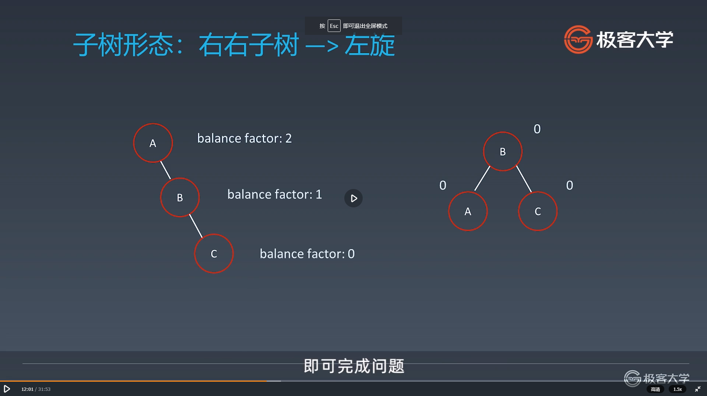
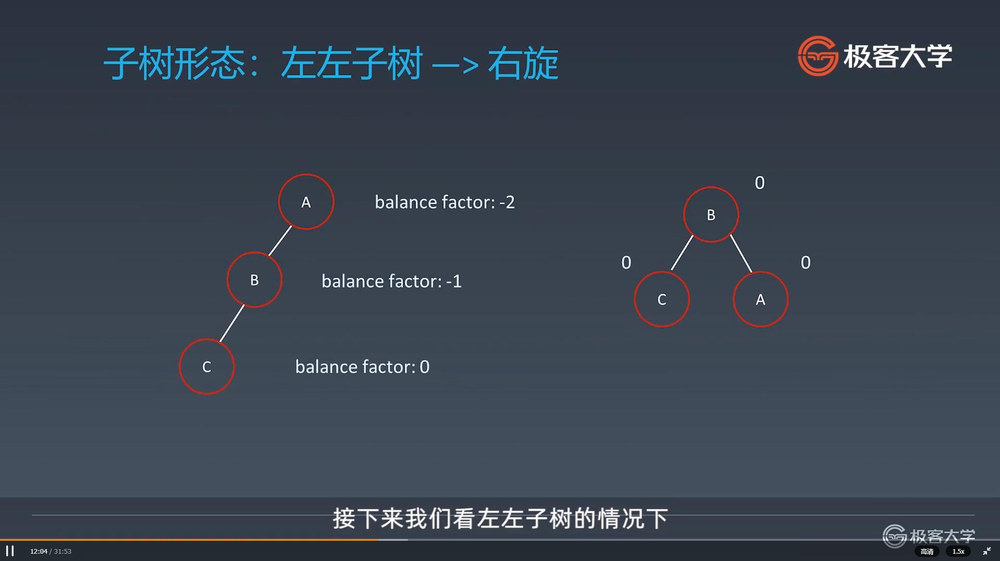
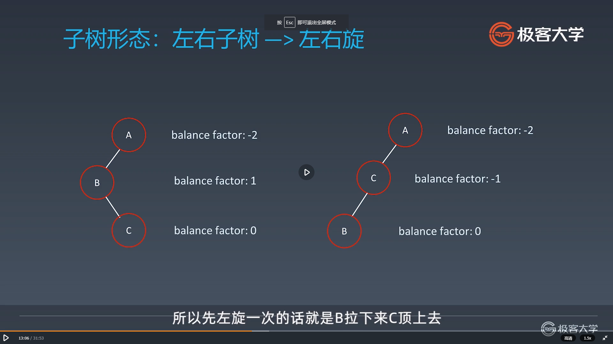
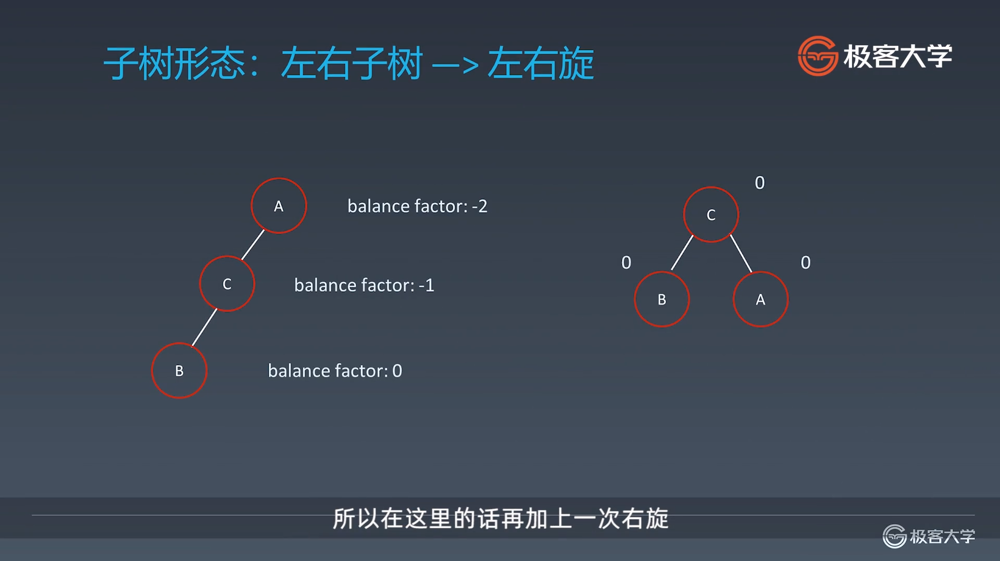
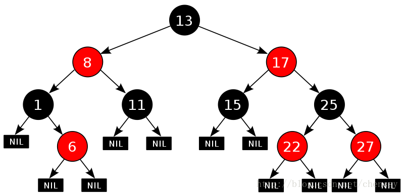
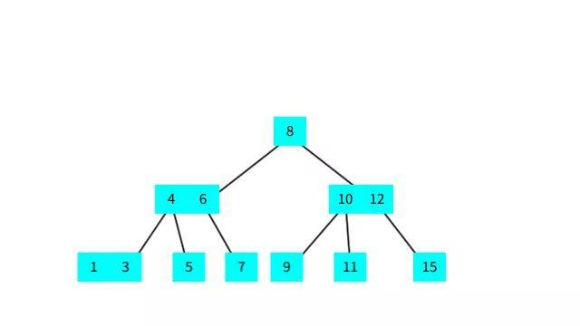
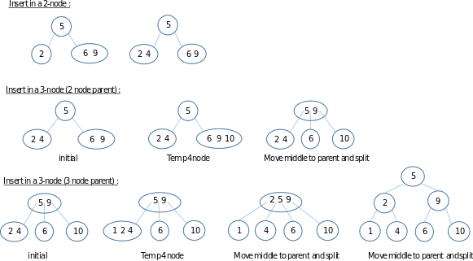
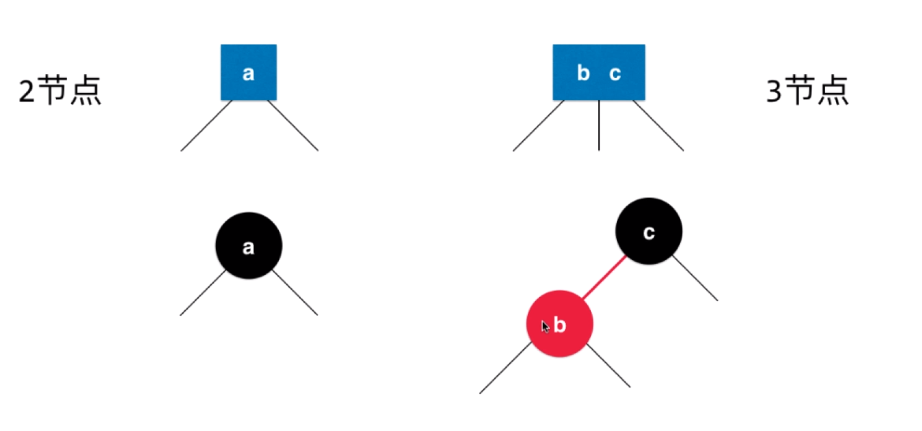
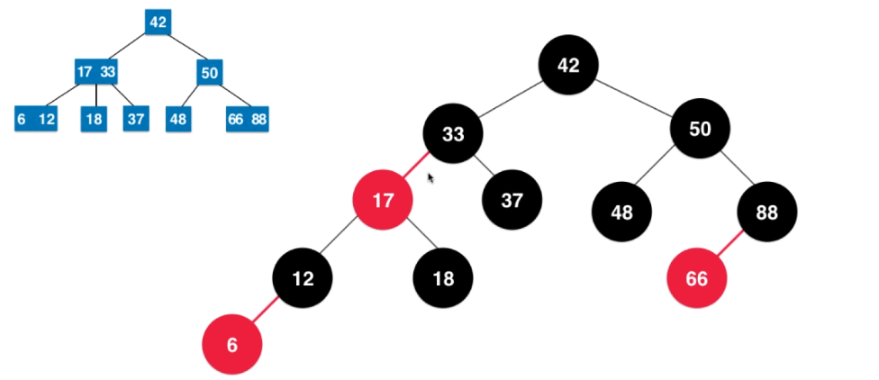

学习笔记

## Tire

字典树， 又称单词查找树或者键树。 是一种树形结构。典型的应用是用于统计和排序大量的字符串（但是不仅限于字符串）， 经常被用于文本词频统计。 优点是最大限度减少无谓的字符串比较。 查找一个单词的复杂度只与单词的长度有关


**Tire的基本性质**

节点本身不存储完整的单词。

 从根节点到某一节点，路径上经过的字符连接起来， 为该节点对应的字符串

每个节点的所有子节点路径代表的字符都不相同

**核心思想**

空间换时间， 利用字符串的公共前缀来降低查询时间的开销以达到提高效率的目的

## 并查集

适合用于解决匹配和组团问题

## AVL树

一种严格平衡的二叉搜索树， 即同时具有二叉搜索树和平衡树的性质：

* 任意一个节点的值比左孩子大比右孩子小
* 任意节点的的左右子树高度差距最大为1

如何维护平衡？ 通过旋转操作

何时维护平衡？ 引入平衡因子的概念， 平衡因子指的是当前节点左子树的高度减去右子树高度得到的差值。 当平衡因子的绝对值超过1时， 进行平衡的维护

**四种基础旋转操作**

1. 左旋

   

​       python代码实现：

​     

```python
	# 对节点y进行向左旋转操作，返回旋转后新的根节点x
    #    y                             x
    #  /  \                          /   \
    # T1   x      向左旋转 (y)       y     z
    #     / \   - - - - - - - ->   / \   / \
    #   T2  z                     T1 T2 T3 T4
    #      / \
    #     T3 T4
    @classmethod
    def left_rotate(cls, node):
        new_root = node.right
        node.right = node.right.left
        new_root.left = node
        
        # 维护高度
        new_root.height = max(cls.get_height(new_root.left), cls.get_height(new_root.right)) + 1
        node.height = max(cls.get_height(node.left), cls.get_height(node.right)) + 1
        return new_root # 返回新的根节点
```


2. 右旋

   

   python代码实现

   ```python
   	# 对节点y进行向右旋转操作，返回旋转后新的根节点x
       #        y                              x
       #       / \                           /   \
       #      x   T4     向右旋转 (y)        z     y
       #     / \       - - - - - - - ->    / \   / \
       #    z   T3                       T1  T2 T3 T4
       #   / \
       # T1   T2
       @classmethod
       def right_rotate(cls, node):
           new_root = node.left
           node.left = node.left.right
           new_root.right = node
   
           new_root.height = max(cls.get_height(new_root.left), cls.get_height(new_root.right)) + 1
           node.height = max(cls.get_height(node.left), cls.get_height(node.right)) + 1
           return new_root
   ```

   

3. 左右旋

   

   ```python
   node.left = self.left_rotate(node.left)
   return self.right_rotate(node.left)
   ```

4. 右左旋

   ```python
   node.right = self.right_rotate(node.right)
   return self.left_rotate(node)
   ```

**AVL插入元素**

```python
    def add(self, node, key, value):

        if node is None:
            self.size += 1
            return self.Node(key, value)

        if key < node.key:
            node.left = self.add(node.left, key, value)
        elif key > node.key:
            node.right = self.add(node.right, key, value)
        else:
            node.value = value

        # 更新height
        node.height = 1 + max(self.get_height(node.left), self.get_height(node.right))

        #
        balance_factor = self.get_balance_factor(node)

        # 左左树
        if balance_factor > 1 and self.get_balance_factor(node.left) >= 0:
            return self.right_rotate(node)
        # 右右树
        if balance_factor < -1 and self.get_balance_factor(node.right) <= 0:
            return self.left_rotate(node)

        # 左右树
        if balance_factor > 1 and self.get_balance_factor(node.left) < 0:
            node.left = self.left_rotate(node.left)
            return self.right_rotate(node.left)

        # 右左树
        if balance_factor < -1 and self.get_balance_factor(node.right) >= 0:
            node.right = self.right_rotate(node.right)
            return self.left_rotate(node)

        return node
```

**AVL删除节点**

```python
    def remove(self, node, key):
        ret = None
        if not node:
            return ret

        if node.key > key:
            node.left = self.remove(node.left, key)
            ret = node
        elif node.key < key:
            node.right = self.remove(node.right, key)
            ret = node
        else:
            if node.left is None:
                rightNode = node.right
                node.right = None
                ret = rightNode

            elif node.right is None:
                leftNode = node.left
                node.left = None
                ret = leftNode

            else:
                # successor minimum of right child(tree)
                # predecessor maximum of left child(tree)
                successor = minimum(node.right)
                successor.right = self.remove(node.right, successor.key)
                successor.left = node.left
                node.left = node.right = None

                ret = successor


        if ret is None:
            return None

        # 更新height
        ret.height = 1 + max(self.get_height(ret.left), self.get_height(ret.right))

        #
        balance_factor = self.get_balance_factor(ret)

        # 左左树
        if balance_factor > 1 and self.get_balance_factor(ret.left) >= 0:
            return self.right_rotate(ret)
        # 右右树
        if balance_factor < -1 and self.get_balance_factor(ret.right) <= 0:
            return self.left_rotate(ret)

        # 左右树
        if balance_factor > 1 and self.get_balance_factor(ret.left) < 0:
            ret.left = self.left_rotate(ret.left)
            return self.right_rotate(ret.left)

            # 右左树
        if balance_factor < -1 and self.get_balance_factor(ret.right) >= 0:
            ret.right = self.right_rotate(ret.right)
            return self.left_rotate(ret)

        return ret
```

优点： 严格平衡的二叉树， 在查询时有着很好的表现

不足： 节点需要额外存储信息， 且调整的次数频繁 。


## 红黑树

一种近似平衡二叉树， 能够确保任何一个节点的左右子树的高度差小于2倍。

长相是这样




**红黑树的五大性质**

* 每个节点不是黑色就是红色
* 根节点是黑色
* 每一个叶子节点(最后的空节点)是黑色的
* 不存在两个直接相邻的红色节点（如果一个节点是红色， 那么他的孩子节点一定是黑色）
* 从任意一个节点到叶子节点，经过的黑色节点是一样的 （核心）（保持“黑平衡”）


红黑树怎么来的？

先学习一下2-3树的原理

#### 2-3树

满足二分搜索树的基本性质， 但每个节点可以存放一个或者两个元素。是一种绝对平衡的树

例如



2-3树添加元素：



图源：维基百科

2-3树在添加元素时， 一定不会向一个空子树插入， 而会和最后找到的叶子节店进行合并）

* 如果插入2节点， 那么就直接融合即可
* 如果插入3节点：
  - ​	如果这个3节点是根节点， 那么直接合并后再拆解
  - ​    如果这个3节点不是根节点， 合并拆解后， 新的根节点需要向上进行融合

 依次递归融合


**红黑树与2-3树的等价性**



一个红节点和一个黑节点就构成了2-3树中的一个三节点 （在这种定义方式下， 所有红色节点都是左倾的）




图片来源： 慕课网波波老师课件

由此来对照红黑树的五大性质和2-3树的性质， 就有一种豁然开朗的感觉了。


红黑树的第五个性质可以知道， 红黑树是一个黑平衡的树， 所以红黑树的最大高度： 2 logn（最多每个黑的节点都接上一个红节点）


**红黑树和AVL对比**

* AVL相比于红黑树提供了更快的查询（因为是严格的平衡二叉树）
* 红黑树提供了更快的添加和删除操作 （旋转次数更少， 是一种近似平衡）
* AVL每个节点都存储平衡因子， 就需要更多的内存（AVL需要一个int型来存储状态， 而红黑树只需要1 bit来存储颜色即可）
* 红黑树被用于大部分语言的库函数map实现中

## 高级搜索

剪枝， 双向BFS， 启发式搜索