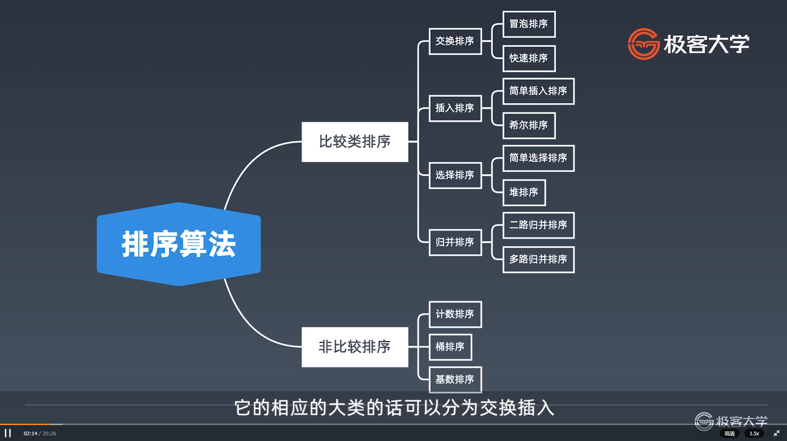
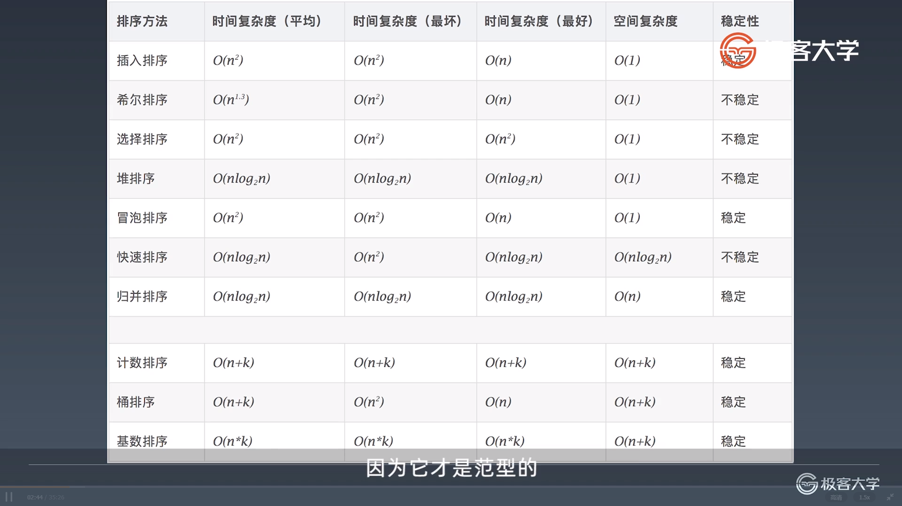

学习笔记

# 位运算

**位运算实战要点**

判断奇偶性：

x%2==1 -> (x&1)==1

x%2==0 ->(x&1)==0

除2：

x>>1 -> x/2

x = x&(x-1) 清零最低位的1

x&-x 得到最低位的1

x&~x=>0


# Bloom Filter

布隆过滤器

一个很长的二进制向量和一系列随机映射函数， 布隆过滤器可以用于检索一个元素是否在一个集合中

优点是空间效率和查询时间都远远超过一般算法

缺点是有一定的误识别率和删除困难（查询结果为true只能说明可能存在， 但为false则一定不存在）

通常用于第一道缓存， 模糊搜索。 如果查询在布隆过滤器中， 就继续向下去DB查找

# 排序

比较类排序：

通过比较来决定元素间的相对次序， 由于其时间复杂度不能突破O（nlogn）， 因此也成为非线性时间比较类排序

非比较类排序：

不通过比较来决定元素间的相对次序， 它可以突破基于比较类排序的时间下界， 以线性时间运行。





**初级排序： O(n^2)**

1.选择排序（Selection Sort）

每次选择最小值， 然后放到待排序数组的起始位置

2.插入排序（Insertion Sort）

从前到后逐步构建有序序列， 对于未排序数据， 在已排序序列中从后向前扫描， 找到相应位置并插入

3.冒泡排序（Bubble Sort）

嵌套循环， 每次查看相邻的元素， 如果逆序则交换

**高级排序：O（nlogn）**

快速排序 （Quick Sort）

数组取标杆pivot， 将小元素放pivot左边， 大元素放右侧， 然后依次对右边和左边的子数组继续快排， 以达到整个序列有序。

```java
    public static void quickSort(int[] array, int begin, int end){
        if (end<=begin) return;
        int pivot = partition(array, begin, end);
        quickSort(array, begin, pivot-1);
        quickSort(array, pivot+1, end);
    }

    private static int partition(int[] array, int begin, int end) {
        int pivot = end, counter = 0;
        for (int i=begin; i<end; i++){
            if (array[i] < array[pivot]){
                int temp = array[counter]; array[counter] = array[i]; array[i] = temp;
                counter++;
            }
        }
        int temp = array[pivot]; array[pivot] = array[counter]; array[counter] = temp;
        return counter;
    }
```

归并排序 （ Merge Sort） -- 分治

把长度为n的输入序列分成两个长度为n/2的子序列； 对这两个子序列分别采用归并排序， 将两个排好序的子序列合并成一个最终的排序序列

```java
    public static void mergeSort(int[] array, int left, int right){
        if (right<=left) return;
        int mid = (left + right) >> 1;

        mergeSort(array, left, mid);
        mergeSort(array, mid+1, right);
        merge(array, left, mid, right);
    }

    private static void merge(int[] arr, int left, int mid, int right){

        int[] temp = new int[right-left+1];
        int i=left, j = mid + 1, k = 0;

        while (i<=mid && j<=right){
            temp[k++] = arr[i] < arr[j] ? arr[i++] : arr[j++];
        }

        while (i<=mid) temp[k++] = arr[i++];
        while (j<=mid) temp[k++] = arr[j++];

        for (int p=0; p<temp.length; p++){
            arr[left+p] = temp[p];
        }

    }
```

堆排序（heap sort）

```java
    public static void heap_sort(int[] array){
        PriorityQueue<Integer> pq = new PriorityQueue<>();

        for (int value : array) pq.add(value);

        for (int i=0; i<array.length; i++)
            array[i] = pq.poll();
    }
```

原地的堆排序可以用heapify

```java
    public static void heapSort(int[] array) {
        if (array.length == 0) return;

        int len = array.length;

        for (int i = len / 2 -1; i>=0; i--)
            heapify(array, len, i);

        for (int i = len -1; i>=0; i--){
            int temp = array[0]; array[0] = array[i]; array[i] = temp;
            heapify(array, i, 0);
        }
    }

    private static void heapify(int[] array, int len, int i) {
        int left = 2*i + 1, right = 2*i+2;
        int largest = i;

        if (left < len && array[left] > array[largest]) largest = left;
        if (right < len && array[right] > array[largest]) largest = right;

        if (largest!=i){
            int temp = array[i]; array[i] = array[largest]; array[largest] = temp;
            heapify(array, len, largest);
        }
    }
```

